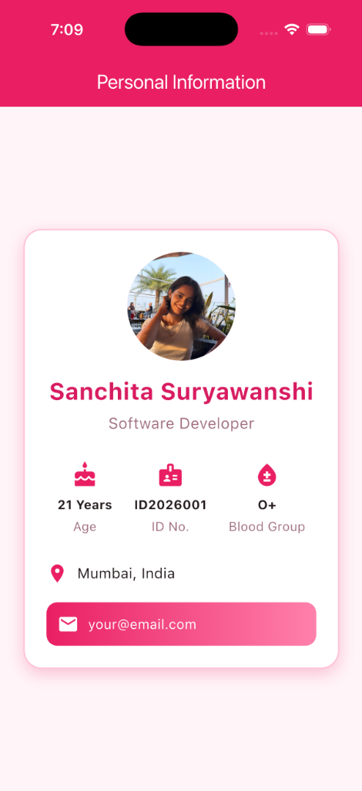

# Profile Card Flutter

A stylish and responsive Personal Information Card built using Flutter.

## 📱 App Preview

<p align="center">
  
</p>

## ✨ Features

- **Elegant Profile Display**: Circular avatar profile picture with custom framing and shadow styling.
- **Personal Details**: Displays name, designation, location, and contact information.
- **Key Statistics Badges**: Icons and highlights for Age, ID Number, and Blood Group.
- **Gradient Actions**: Styled interactive gradient contact badge.
- **Responsive Layout**: Designed to adapt cleanly across screen sizes and orientations.

## 🛠️ Built With

- **Flutter** (v3.47+)
- **Dart** (v3.13+)
- **Material 3 Design**

## 🚀 Getting Started

### Prerequisites

- [Flutter SDK](https://docs.flutter.dev/get-started/install) installed
- An iOS Simulator / Android Emulator or physical device

### Installation & Run

1. Clone the repository:
   ```bash
   git clone https://github.com/sanchitaaa10/Profile_Card_Flutter-.git
   cd Profile_Card_Flutter-
   ```

2. Install dependencies:
   ```bash
   flutter pub get
   ```

3. Run the application:
   ```bash
   flutter run
   ```

---
*Created by [Sanchita Suryawanshi](https://github.com/sanchitaaa10)*
